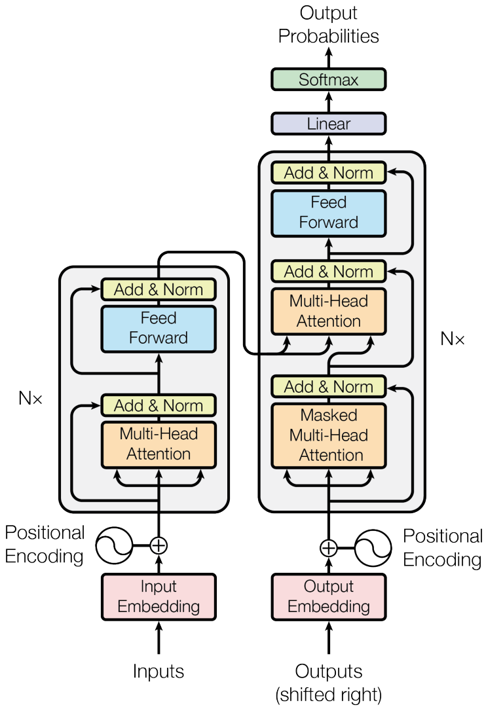
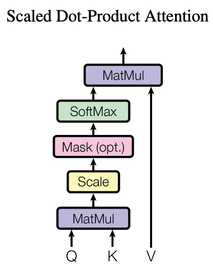

# transformer-from-scratch

A step-by-step reimplementation of the original Transformer model in PyTorch, built from scratch for learning purposes.  
Based on the paper [“Attention Is All You Need”](https://arxiv.org/abs/1706.03762).

- [Background](#Background)
- [Part 1: Model Architecture](#part01-model-architecture)
  - [Encoder and Decoder Stacks](#encoder-and-decoder-stacks)
## Background

​	在 Transformer 出现之前，深度学习领域主要依赖两种主流架构：卷积神经网络（CNN）和循环神经网络（RNN）。其中，CNN 通常应用于图像相关任务，例如图像分类（如 ImageNet 数据集上的分类任务），而 RNN 及其变种（如 LSTM、GRU）则广泛用于建模序列数据，尤其是在自然语言处理任务中，如机器翻译（如基于 RNN 的 Seq2Seq 模型在 WMT 任务中的应用）。然而，尽管这两类模型在各自领域取得了显著成果，它们在`处理长距离依赖`、`并行计算效率`和`建模能力`方面存在一定的局限性。这些挑战为 Transformer 架构的提出奠定了背景与动因。

- 基于卷积神经网络的架构（CNN）

[待补充]

- 基于循环神经网络的架构（RNN）

[待补充]


相较于卷积神经网络（CNN），Transformer 借助自注意力机制（Self-Attention）在每一层直接建模任意两个位置之间的依赖关系，从而具备强大的全局建模能力与良好的可扩展性。虽然 CNN 能通过局部感受野与堆叠层级实现一定程度的长距离建模，但其感受野增长缓慢，难以高效捕捉全局依赖关系。与传统的循环神经网络（RNN）相比，Transformer 完全摒弃了序列化的递归结构，转而通过位置编码（Positional Encoding）引入位置信息，使得模型能够在保持顺序感的同时并行处理整个序列，显著提升了训练效率。此外，Transformer 的核心模块还包括多头注意力机制、前馈神经网络、残差连接以及层归一化，使其在深度堆叠的同时依然保持稳定的训练性能。凭借上述优势，Transformer 架构已逐步取代传统的 RNN 和 CNN，成为自然语言处理、时间序列建模乃至图像理解等多个领域的主流选择。[待补充计算复杂度计算]


### Part01: Model Architecture
**Encoder-Decoder 架构**是一种广泛应用于序列建模任务的神经网络结构，主要包括两个部分：编码器（Encoder）和解码器（Decoder）。
- **编码器**负责接收输入序列，并将其逐步转换为一个固定长度或可变长度的上下文表示（context representation），即高维语义向量。
- **解码器**则基于该上下文表示，逐步生成目标输出序列，通常采用自回归方式（autoregressive），即一步步预测后续输出。
该架构最早应用于神经机器翻译（Neural Machine Translation, NMT），但由于其良好的通用性和表达能力，已经广泛应用于**文本生成、语音识别、图像字幕生成、时间序列预测**等各类输入输出成对的序列任务中。一个标准的Encoder-Decoder架构代码如下：
```python
from torch import nn
from torch.nn.functional import log_softmax


class EncoderDecoder(nn.Module):
    """
    A standard Encoder-Decoder architecture.
    Base for this and many other encoder-decoder architectures.
    """

    def __init__(self, encoder, decoder, src_embed, trg_embed, generator):
        super(EncoderDecoder, self).__init__()
        self.encoder = encoder
        self.decoder = decoder
        self.src_embed = src_embed
        self.trg_embed = trg_embed
        self.generator = generator
        pass

    def forward(self, src, tgt, src_mask, tgt_mask):
        """Take in and process masked src and target sequences."""
        return self.decode(self.encode(src, src_mask), src_mask, tgt, tgt_mask)

    def encode(self, src, src_mask):
        return self.encoder(self.src_embed(src), src_mask)

    def decode(self, memory, src_mask, tgt, tgt_mask):
        return self.decoder(self.trg_embed(tgt), memory, src_mask, tgt_mask)


class Generator(nn.Module):
    """
    Define a standard linear + softmax generation step.
    """

    def __init__(self, d_model, vocab):
        super(Generator, self).__init__()
        self.proj = nn.Linear(d_model, vocab)

    def forward(self, x):
        return log_softmax(self.proj(x), dim=-1)
```

Transformer 的 Encoder 和 Decoder 结构均由多层堆叠而成，每层包含自注意力机制与逐位置的前馈全连接网络（Point-wise Feed-Forward Network），其整体架构如图所示：
<div style="text-align: center;">
  
</div>

#### Encoder and Decoder Stacks
##### Encoder
Encoder堆叠了6层，同时按照原文的设计我们会使用残余连接在两子层之间并紧跟层归一化，其可以被如下描述：
```python
import torch
from torch import nn
import copy

def clones(module, N):
    """
    Produce N identical layers.
    """
    return nn.ModuleList([copy.deepcopy(module) for _ in range(N)])


class Encoder(nn.Module):
    """
    Core encoder is a stack of N layers are given
    """

    def __init__(self, layer, N):
        super(Encoder, self).__init__()
        self.layers = clones(layer, N)
        self.norm = LayerNorm(layer.size)

    def forward(self, x, mask):
        """
        Pass the input (and mask) through each layer in turn.
        """
        for layer in self.layers:
            x = layer(x, mask)
        return self.norm(x)

class LayerNorm(nn.Module):
    """
    Construct a layer norm module
    """
    def __init__(self, features, eps=1e-6):
        super(LayerNorm, self).__init__()
        self.a_2 = nn.Parameter(torch.ones(features))
        self.b_2 = nn.Parameter(torch.zeros(features))
        self.eps = eps

    def forward(self, x):
        mean = x.mean(-1, keepdim=True)
        std = x.std(-1, keepdim=True)
        return self.a_2 * (x - mean) / (std + self.eps) + self.b_2

```
实际上，每一子层的输出都是`LayerNorm(x + Sublayer(x))`，
而这里的`Sublayer(x)`子层自身所实现的函数。我们会在每一层的输出上
使用`dropout`在他到下一层输入和归一化之前。为了促进这些残差连接，
模型中的所有子层以及嵌入层都会产生维度为`d_model=512`
```python
class SublayerConnection(nn.Module):
    """
    A residual connection followed by a layer norm.
    Note for simplicity the norm is first as opposed to last.
    """
    def __init__(self, size, dropout):
        super(SublayerConnection, self).__init__()
        self.norm = LayerNorm(size)
        self.dropout = nn.Dropout(dropout)

    def forward(self, x, sublayer):
        """
        Apply residual connection to any sublayer with same size.
        """
        return x + self.dropout(sublayer(self.norm(x)))
```
每一层都包含2个关键的成分，一个是多头自注意力机制，第二个是逐点全连接前馈网络。基本如下：
```python
class EncoderLayer(nn.Module):
    """
    Encoder is made up if self-attn and feed forward
    """

    def __init__(self, size, self_attn, feed_forward, dropout):
        super(EncoderLayer, self).__init__()
        self.self_attn = self_attn
        self.feed_forward = feed_forward
        self.sublayer = clones(SublayerConnection(size, dropout), 2)
        self.size = size

    def forward(self, x, mask):
        x = self.sublayer[0](x, lambda x: self.self_attn(x, x, x, mask))
        return self.sublayer[1](x, self.feed_forward)
```
##### Decoder
Encoder层同样也是堆叠了6层。如下：
```python
class Decoder(nn.Module):
    """
    Generic N layer decoder with masking
    """
    def __init__(self, layer, N):
        super(Decoder, self).__init__()
        self.layers = clones(layer, N)
        self.norm = LayerNorm(layer.size)

    def forward(self, x, memory, src_mask, tgt_mask):
        for layer in self.layers:
            x = layer(x, memory, src_mask, tgt_mask)
        return self.norm(x)
```
除了每个编码器层中的两个子层外，解码器还插入了第三个子层， 对编码器堆栈的输出执行多头关注。
与编码器类似，我们在每个子层周围采用残差连接，然后进行层归一化。
```python
class DecoderLayer(nn.Module):
    """
    Decoder is made up of self-attn, src_attn, feed forward, drop_out
    """
    def __init__(self,size,self_attn, src_attn, feed_forward, dropout):
        super(DecoderLayer, self).__init__()
        self.size = size
        self.self_attn = self_attn
        self.src_attn = src_attn
        self.feed_forward = feed_forward
        self.sublayer = clones(SublayerConnection(size,dropout),3)

    def forward(self,x, memory, src_mask, tgt_mask):
        m = memory
        x = self.sublayer[0](x, lambda x: self.self_attn(x, x, x, tgt_mask))
        x = self.sublayer[1](x, lambda x: self.src_attn(x, m, m, src_mask))
        return self.sublayer[2](x, self.feed_forward)
```
我们还修改了解码器堆栈中的自我关注子层，以防止位置关注到后续位置。
这种屏蔽，加上输出嵌入偏移一个位置的事实，确保了对位置`i`的预测只能取决于小于`i`
```python
def subsequent_mask(size):
    """
    Mask out subsequent positions.
    """
    attn_shape = (1, size, size)
    subsequent_mask = torch.triu(torch.ones(attn_shape), diagonal=1).type(
        torch.uint8
    )
    return subsequent_mask == 0
```
注意力机制，注意力函数可以描述为将一个查询和一组键值对映射到一个输出，其中查询、键、值和输出都是向量。
输出是以值的加权和来计算的，其中分配给每个值的权重是通过查询与相应键的兼容函数来计算的。
<div style="text-align: center;">
  
</div>

```python
def attention(query, key, value, mask=None, dropout=None):
    """
    Compute 'Scaled Dot Product Attention'

    attn(q,k,v) = softmax(Q*K^T/sqrt(d_k)+M)*V
    """
    # try to get d_model
    d_k = query.size(-1)
    scores = torch.matmul(query, key.transpose(-2,-1)) / math.sqrt(d_k)
    if mask is not None:
        scores = scores.masked_fill(mask == 0, -1e9)
    p_attn = scores.softmax(dim=-1)
    if dropout is not None:
        p_attn = dropout(p_attn)
    return torch.matmul(p_attn,value), p_attn
```
加法注意使用单隐层前馈网络计算兼容性函数。虽然两者的理论复杂度相似，但点积注意力在实际应用中速度更快，
空间效率更高，因为它可以使用高度优化的矩阵乘法代码来实现。
